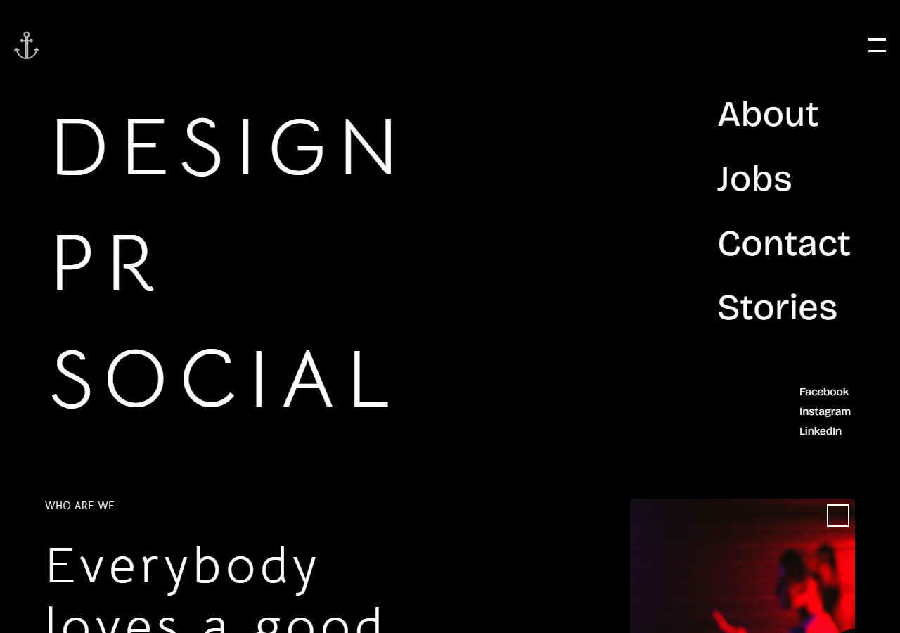

# Design PR Social

A creative agency landing page with scroll-driven animation and interactive visual effects.

## Overview

A single-page marketing site for a design/PR/social creative agency, featuring a water-ripple hero effect, custom cursor, film-grain overlay, and smooth-scroll animated sections (About, Who We Are, Services, Contact).

## Screenshots

| Landing page |
|---|
|  |

## Technology Stack

- Next.js 14 (App Router), React 18, TypeScript
- Tailwind CSS, Sass
- Framer Motion, Lenis (smooth scroll), Swiper
- `react-water-wave` (interactive ripple effect), custom animated cursor

## Local Installation

```bash
git clone https://github.com/Rockstar100/Assign.git
cd Assign
npm install
npm run dev
```

Open [http://localhost:3000](http://localhost:3000).

## Available Commands

| Command | Description |
|---|---|
| `npm run dev` | Run in development mode |
| `npm run build` | Build for production |
| `npm start` | Run the production build |
| `npm run lint` | Run ESLint |

## Project Structure

```
Assign/
├── app/
│   ├── layout.tsx
│   └── page.tsx
├── sections/          # About, Contact, Header, Serve, WhoWeAreSection, ...
├── components/
│   ├── visualEffects/   # GrainEffect, WaterWaveWrapper
│   └── cursor/           # Custom cursor
└── lib/utils.ts
```

## Deployment

Fully static/client-rendered — no backend or database, so it's a good fit for GitHub Pages, Vercel, or Netlify.

## Known Limitations

- `@emailjs/browser` is listed as a dependency but not currently wired up to the contact section.
- No automated tests.

## Future Improvements

- Wire up the contact form to EmailJS (or a backend endpoint) so it actually sends messages.
- Add a smoke test for the main page.

## License

MIT — see [LICENSE](LICENSE).

## Author

**Parveen Jaiswal**
GitHub: [@Rockstar100](https://github.com/Rockstar100)
